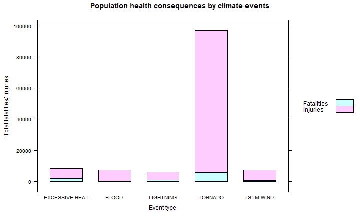

# Effect of climate events on health and economy
By: DicksonC  
Dataset source: U.S. National Oceanic and Atmospheric Administration's (NOAA)  

This project reflects the most devastating climate events affecting population health and nation's economy in general.  The NOAA storm database used will tracks characteristics of major storms and weather events in the United States, including when and where they occur, as well as estimates of any fatalities, injuries, and property damage.


```r
# Loading libraries required
library(dplyr)
library(lattice)
```

### Data Processing
The data was sourced directly from the NOAA database website:  
1. A temporary directory `temp` was created for storing the dataset temporarily.  
2. Dataset was downloaded to the `temp` directory.  
3. Reading the csv file from the bz2 zip file.  
4. Disconnecting the database connection.  
5. Converting dataset into tibble dataframe from dplyr library for the ease of analysis later.


```r
temp <- tempfile()
download.file("http://d396qusza40orc.cloudfront.net/repdata%2Fdata%2FStormData.csv.bz2", temp)
data <- read.csv(bzfile(temp, "repdata_data_StormData.csv"), header = TRUE)
unlink(temp)
tbl <- as_tibble(data)
tbl
```

```
## # A tibble: 902,297 x 37
##    STATE__ BGN_DATE BGN_TIME TIME_ZONE COUNTY COUNTYNAME STATE
##      <dbl> <chr>    <chr>    <chr>      <dbl> <chr>      <chr>
##  1       1 4/18/19~ 0130     CST           97 MOBILE     AL   
##  2       1 4/18/19~ 0145     CST            3 BALDWIN    AL   
##  3       1 2/20/19~ 1600     CST           57 FAYETTE    AL   
##  4       1 6/8/195~ 0900     CST           89 MADISON    AL   
##  5       1 11/15/1~ 1500     CST           43 CULLMAN    AL   
##  6       1 11/15/1~ 2000     CST           77 LAUDERDALE AL   
##  7       1 11/16/1~ 0100     CST            9 BLOUNT     AL   
##  8       1 1/22/19~ 0900     CST          123 TALLAPOOSA AL   
##  9       1 2/13/19~ 2000     CST          125 TUSCALOOSA AL   
## 10       1 2/13/19~ 2000     CST           57 FAYETTE    AL   
## # ... with 902,287 more rows, and 30 more variables:
## #   EVTYPE <chr>, BGN_RANGE <dbl>, BGN_AZI <chr>,
## #   BGN_LOCATI <chr>, END_DATE <chr>, END_TIME <chr>,
## #   COUNTY_END <dbl>, COUNTYENDN <lgl>, END_RANGE <dbl>,
## #   END_AZI <chr>, END_LOCATI <chr>, LENGTH <dbl>, WIDTH <dbl>,
## #   F <int>, MAG <dbl>, FATALITIES <dbl>, INJURIES <dbl>,
## #   PROPDMG <dbl>, PROPDMGEXP <chr>, CROPDMG <dbl>,
## #   CROPDMGEXP <chr>, WFO <chr>, STATEOFFIC <chr>,
## #   ZONENAMES <chr>, LATITUDE <dbl>, LONGITUDE <dbl>,
## #   LATITUDE_E <dbl>, LONGITUDE_ <dbl>, REMARKS <chr>,
## #   REFNUM <dbl>
```

### Results
#### Events that are most harmful with respect to population health
Here we groups our data and sort it out to get the event with highest fatalities and injuries combined:  
1. Group by event types.  
2. Summarize the data into sum of fatalities and injuries on each types of event group.  
3. Filter out empty values.  
4. Create a new `total` column to compute the sum of both fatalities and injuries.  
5. Sort the tibble in descending order of `total`.


```r
health <- tbl %>% 
          group_by(EVTYPE) %>%
          summarize(fatalities = sum(FATALITIES), injuries = sum(INJURIES)) %>%
          filter(injuries!=0 & fatalities!=0) %>%
          mutate(total = injuries + fatalities) %>%
          arrange(desc(total))
head(health)
```

```
## # A tibble: 6 x 4
##   EVTYPE         fatalities injuries total
##   <chr>               <dbl>    <dbl> <dbl>
## 1 TORNADO              5633    91346 96979
## 2 EXCESSIVE HEAT       1903     6525  8428
## 3 TSTM WIND             504     6957  7461
## 4 FLOOD                 470     6789  7259
## 5 LIGHTNING             816     5230  6046
## 6 HEAT                  937     2100  3037
```


```r
barchart(fatalities+injuries ~ EVTYPE, 
         data = health[1:5,],
         stack = TRUE,
         main = "Population health consequences by climate events",
         xlab = "Event type",
         ylab = "Total fatalities/ injuries",
         auto.key = list(space='right', text=c('Fatalities','Injuries')))
```



Obviously from both the table and plot, **tornado event brings both the highest fatalities and injuries, followed by excessive heat**  
  
#### Event types that have the greatest economic consequences
Here we groups our data and sort it out to get the event with the greatest economic losses in both property and crop:  
1. Filter out "B" to get the largest unit in the group.  (The idea here is to choose events with both losses in billions instead of millions and thousands).  
2. Group by event types.  
3. Summarize the data into sum of property and crop losses on each types of event group.  
4. Create a new `totaldmg` column to compute the sum of both property and crop losses.  
5. Sort the tibble in descending order of `totaldmg`.

```r
economy <- tbl %>% 
           filter(PROPDMGEXP=="B", CROPDMGEXP=="B") %>%
           group_by(EVTYPE) %>%
           summarize(propdmg = sum(PROPDMG), cropdmg = sum(CROPDMG)) %>%
           mutate(totaldmg = propdmg + cropdmg) %>%
           arrange(desc(totaldmg))
economy
```

```
## # A tibble: 2 x 4
##   EVTYPE            propdmg cropdmg totaldmg
##   <chr>               <dbl>   <dbl>    <dbl>
## 1 RIVER FLOOD          5       5       10   
## 2 HURRICANE/TYPHOON    5.88    1.51     7.39
```


```r
barchart(propdmg+cropdmg~EVTYPE, 
         data = economy,
         stack = TRUE,
         main = "Economic consequences by climate events",
         xlab = "Event type",
         ylab = "Total economic losses",
         auto.key = list(space='right', text=c('Property','Crop')))
```


Although Hurricane/Typhoon brings a greater property damage, **River Flood results in a much higher economic losses** with property and crop combined.
